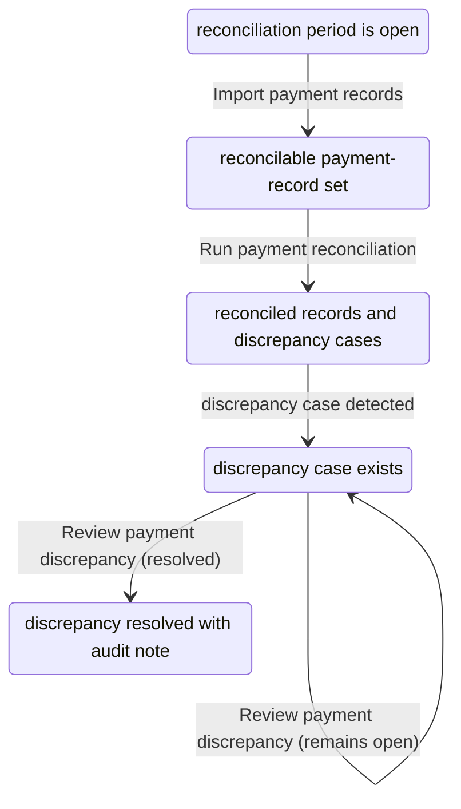

# Example: Reconcile Payments

Status: illustrative internal-capability example. It demonstrates that a Capability MLE does not need to be externally visible.

## Identity

- **Name:** Reconcile payments
- **Definition:** Enable an organization to compare recorded payment obligations and transactions against authoritative payment records, identify discrepancies, and produce a reviewable reconciliation outcome.
- **Status:** example

## Core meaning

- **Capability purpose:** Maintain trustworthy financial records by detecting and resolving mismatches between expected and received payment information.
- **Meaningful outcome:** A reconciliation run produces matched records and clearly identified discrepancies that can be reviewed or resolved by an authorized finance actor.
- **Boundaries — includes:** importing payment records; matching records to obligations; classifying discrepancies; producing review outcomes.
- **Boundaries — excludes:** initiating payments; changing provider settlement; collecting from a payer; writing off a balance without authorized review.
- **Terms and concepts:** `payment record`, `obligation`, `reconciliation period`, `discrepancy case`.

## Interaction Contract MLEs

### Import payment records

- **Actor:** authorized scheduler, finance operator, or integration
- **Command / intent:** make authoritative payment records available for reconciliation
- **Current state:** a reconciliation period is open
- **Transition:** payment records become available for the period
- **Result:** a reconcilable payment-record set
- **Events / effects:** `PaymentRecordsImported`

### Run payment reconciliation

- **Actor:** reconciliation service or authorized finance operator
- **Command / intent:** compare payment records with recorded obligations
- **Current state:** reconcilable payment records and obligations are available
- **Rule / invariant:** a record must not be marked matched when required identifying evidence is absent. **[example]**
- **Transition:** open period → reconciled records and discrepancy cases
- **Result:** matched, unmatched, duplicate, or ambiguous payment outcomes
- **Events / effects:** `PaymentReconciliationCompleted`, `PaymentDiscrepancyDetected`

### Review payment discrepancy

- **Actor:** authorized finance operator
- **Command / intent:** review and classify a discrepancy
- **Current state:** a discrepancy case exists
- **Rule / invariant:** only an authorized finance actor may resolve or write off a discrepancy. **[example]**
- **Transition:** discrepancy remains open or is marked resolved with an audit note
- **Result:** a documented discrepancy-review outcome
- **Events / effects:** `PaymentDiscrepancyReviewed`

### Illustrative state flow (Mermaid)

Non-normative. Every state and transition below restates what the three Interaction Contract MLEs above already declare.

## Rules, defaults, and unknowns

- **Rule / invariant:** reconciliation outcomes must preserve enough evidence for an authorized reviewer to understand the match or discrepancy. **[example]**
- **Recommended default:** surface ambiguous matches for review rather than marking them reconciled automatically. **[example]**
- **Unknowns:** provider contracts, matching tolerances, authorization model, and accounting adjustment rules.

## Optional: illustrative operational realization

- **Realization:** reconciliation service
- **Execution mode:** `software-primary`
- **Exposure:** internal workflow
- **Rationale / intent:** an organization may implement this to improve financial-record integrity; this is not part of the reusable capability purpose.

## Optional: Related MLEs by Dimension

Traceability only. Two dimensions are deliberately omitted rather than filled: **Interaction/Behaviour** (the three Interaction Contract MLEs above already are this capability's own required core — restating them as a "related" MLE would add nothing) and **API/Interoperability** (no API surface is known for this internal capability; "none" is not the same as an entry).

| Dimension | Relationship | Related MLE | Notes |
|---|---|---|---|
| Business/Domain | implements | Discrepancy classification policy (duplicate / unmatched / ambiguous) | **[example]** |
| UX/Experience | supports | Finance-operator discrepancy review queue | The one human-facing touchpoint in an otherwise internal capability. |
| Communication | defines | Discrepancy Escalation Notice | See Communication MLE below. |
| Frontend/Interface | supports | Discrepancy review queue UI | **[implementation choice]** |
| Backend/Execution | implements | ImportPaymentRecords, RunReconciliation, ReviewDiscrepancy use cases | **[implementation choice]** |
| Data/Information | implements | PaymentRecord, Discrepancy entities | **[implementation choice]** |
| Agentic | supports | Ambiguous-discrepancy triage assistant | Illustrative: an agent may pre-classify ambiguous cases for the human reviewer; execution mode `agent-primary-using-software`; it supports, not replaces, the finance operator's own review authority. |
| Verification | verifies | "An unmatched record is never silently marked resolved"; "a duplicate payment is not reconciled twice" | |
| Operations | supports | Reconciliation run monitoring / schedule | **[implementation choice]** |

### Communication MLE: Discrepancy Escalation Notice

- **Purpose:** Alert the responsible finance operator that a payment discrepancy needs review, with enough context to act.
- **Trigger:** A discrepancy case is created by *Run payment reconciliation* (`PaymentDiscrepancyDetected`).
- **Audience:** Authorized finance operator.
- **Required meaning:** a discrepancy exists; its classification (unmatched / duplicate / ambiguous); where to review it; that no automatic write-off has occurred.
- **Terminology:** call it a "discrepancy," never an "exception" or "anomaly," consistently across every realization. **[example]**
- **Tone / style:** neutral and operational — this is routine finance work, not an incident. **[example]**
- **Rule:** must not state or imply that a discrepancy has been resolved before an authorized finance actor has reviewed it. **[rule/invariant — constrains this Communication MLE; mirrors the capability-level rule above]**
- **Recommended default:** if a review-time expectation exists, state it; otherwise, do not invent one. **[recommended default]**
- **Possible realizations:** internal dashboard queue item; scheduled email digest; chat notification.
- **Example copy:** "New discrepancy #4821 — ambiguous match, $128.40. Review in the reconciliation queue." **[example]**

This is also the resolution of an open design question from the CRD site iteration plan: is Communication always a per-capability MLE, or does some of it belong in something Source Context Reference-shaped? This trial shows both are true at once, for different content — the *Discrepancy Escalation Notice* itself is owned by this capability (its trigger, audience, and required meaning come from here and nowhere else), but a cross-cutting rule like "never call it an exception" would belong in a product's Source Context Reference if one existed, and this Communication MLE would reference it rather than restate it. Communication MLE ownership and SCR-held terminology conventions are complementary, not competing.

## Why this example matters

No external customer needs to see this capability for it to be a complete Capability MLE. It has an independent purpose, meaningful outcome, rules, executable behaviours, and a realization. This is why external observability is not a requirement for a CRD.
